# noisy-article-generator

An image generator that generates pairs of images for machine learning purposes.

# Sample Output

| Clean | Dirty |
|-------|-------|
| 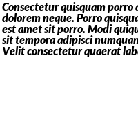 | 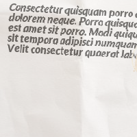 |
| 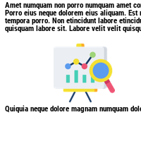 | 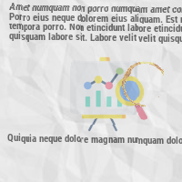 |
| 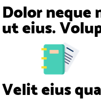 | 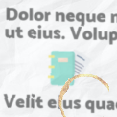 |
| 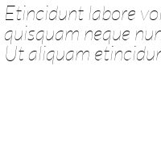 | 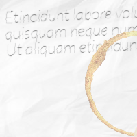 |
| 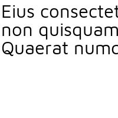 | 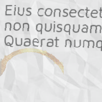 |
| 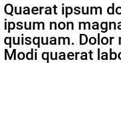 | 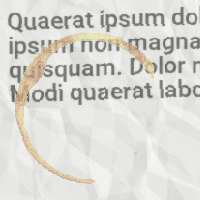 |

# Quick Start

You must have Python 3.6 installed. Other Python 3 versions may not work as expected.

Install this script and other dependencies by running this command:

```
pip3 install -e .
```

Run `noisy-article-generate -h` to see all arguments that you can input.

# Requirements

The program expects these folders to be populated with the relevant files.

`fonts`: All fonts that you want the program to consider using during generation. File extension: `.ttf`

`clipart`: All clipart that you want the program to consider using during generation. File extension: `.png || .jpg`

`stains`: All stains that you want the progrram to consider using during generation. File extension: `.png || .png`

`textures`: All textures that you want the program to consider using during generation. File extension: `.jpg || .png`

# Generating images

You can generate images by entering the command `noisy-article-generate` in any directory that has the required input folders. The program will output to an `out` directory, with the clean and dirty images separated into their respective folders.

# Credits

### Textures

- [Crumpled Paper](http://www.psdgraphics.com/textures/crumpled-paper-texture/)
- [Folded Paper](http://creativity103.com/collections/Paper/slides/paper_creases.html)
- [Crumpled Paper 2](http://www.textures4photoshop.com/tex/paper/seamless-texture-crumpled-paper-free.aspx)

### Clipart / Icons

Icons made by [Freepik](https://www.flaticon.com/authors/freepik) on [FlatIcon](https://www.flaticon.com)

### Fonts

Taken from [Google Fonts](https://fonts.google.com).

### Stains

- [Coffee Stain 1](https://www.freeiconspng.com/img/33689)
- [Coffee Stain 2](https://www.freeiconspng.com/img/33681)
- [Coffee Stain 3](https://www.freeiconspng.com/img/33675)